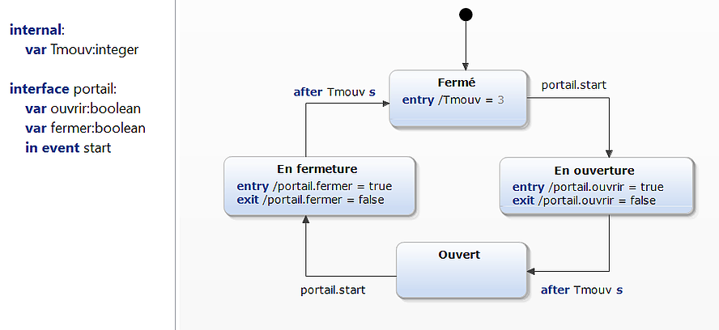
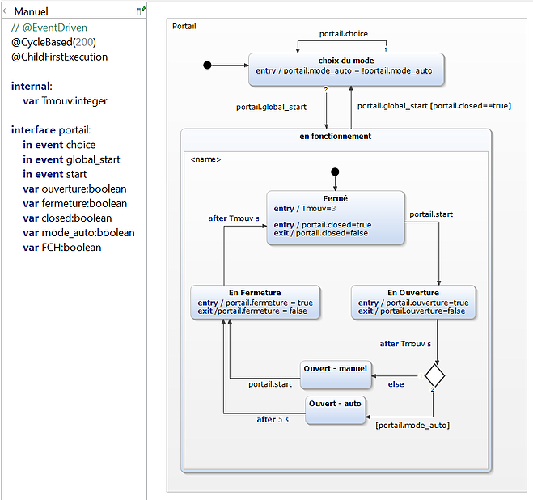
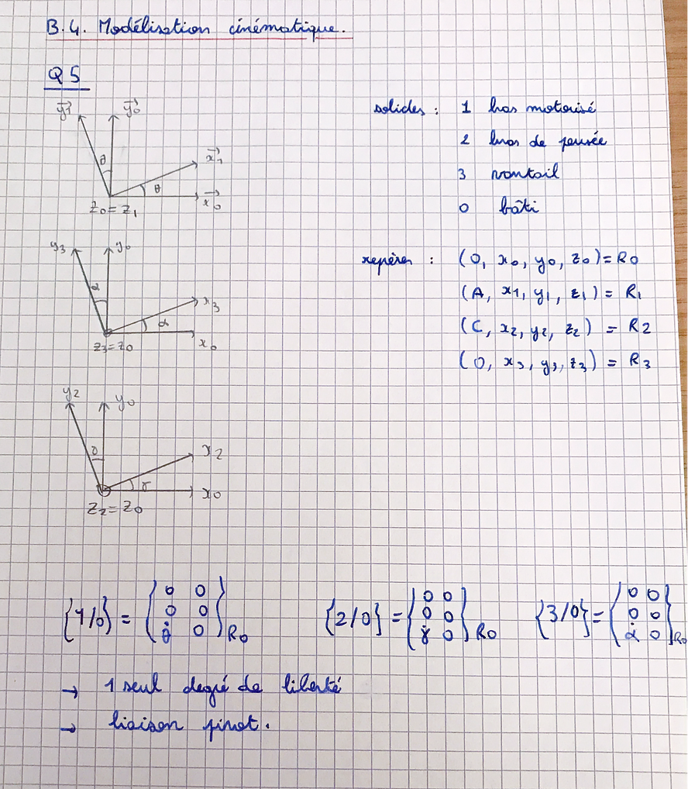
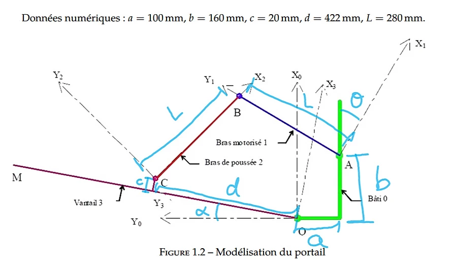
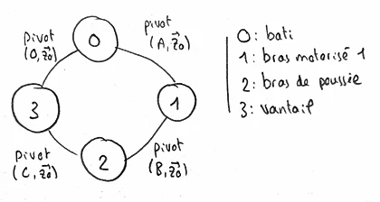
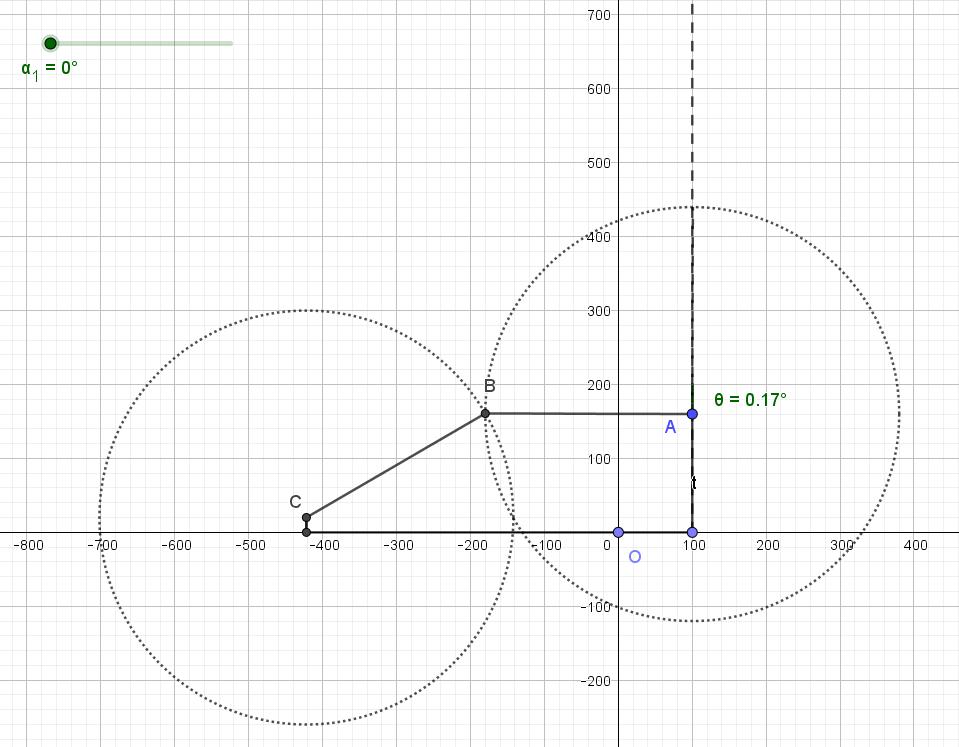
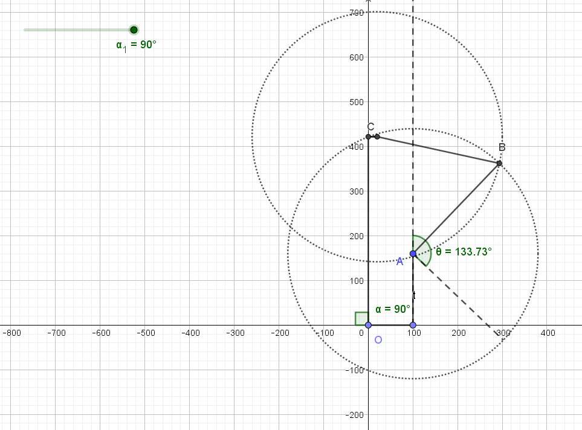
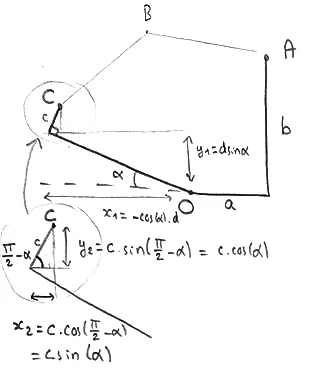
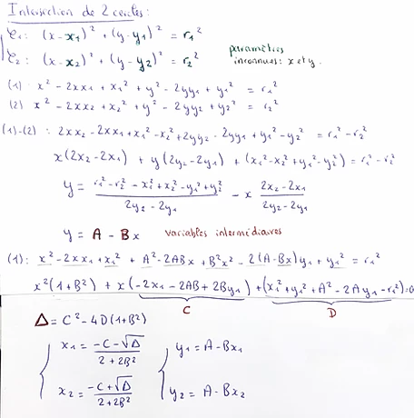

# TP Portail

###### B. Jean-Charles & E. Gallien


> (n'hésitez pas à dézoomer un peu via Ctrl+molette pour ajuster l'affichage)


## I - Fonctionnement du portail

**1 )** Le système basique :





**2 ) et 3 )** Ajout du <u>mode automatique</u>, avec possibilité retourner en manuel via l'évènement "portail.choice".

Nous avons également ajouté une condition empêchant de changer de mode lorsque le portail est en fonctionnement ("portail.closed ==  true").

Remarque : la variable "TCA" du sujet (dont le nom n'est pas très explicite) correspond ici à "portail.mode_auto". (True = automatique, False = Manuel)





**4 )** Prise en compte de la <u>cellule photoélectrique</u> ("portail.FCH"). Elle fonctionne en même temps que le portail (d'où les états orthogonaux), pour permettre d'actualiser en direct la variable "portail.obstacle" sur True lorsque l'évènement "portail.obstacle_présent" se déclenche (puis sur False avec l'évènement "portail.obstacle_absent"). Le portail va alors interpréter cette variable simultanément.

Le fait que la cellule photoélectrique soit dans un état orthogonal permet également de changer son mode de fonctionnement  (FCH=0 ou FCH=1) à tout moment, sans interrompre le reste du programme.

*(vous pouvez agrandir l'image via "clic droit/afficher l'image")*


vidéo démonstrative :

<video controls src="index.assets/video yakindu.mp4"></video>


Si besoin, les fichiers Yakindu sont disponibles [ici](https://drive.google.com/drive/folders/1cLaok-8nyTqGJd6aL4lobHkKfNDdPCbi). (Cliquer simplement sur "Tout télécharger", à droite)


## II - Modélisation cinématique

**5 )** 





**6 )**




**7 )** Tracé à la règle et au compas du mécanisme :





et une petite animation pour le plaisir :


**8 à 11 )** à compléter


**12 )** Le point B se trouve à l'intersection des cercles de centres $A (a,b)$ et $C (x_c,y_c)$

 tous deux de rayon L. On commence donc par déterminer la position du point  $C$ :

 bref,   $\begin{cases}x_c = c.\sin(\alpha) - d.cos(\alpha) \\ y_c = d.\sin(\alpha) + c.cos(\alpha) \end{cases}$


On cherche ensuite les points d'intersections de deux cercles, dans le cas général. Ce n'est peut-être pas la méthode la plus simple mais ça fonctionne :




Il ne reste plus qu'à coder tout ça en python, et on connaît la position de B en fonction de alpha ! (avec un petit bonus à la fin)

```python
from math import sin, cos, sqrt
import matplotlib.pyplot as plt
from mpl_toolkits.mplot3d import Axes3D


# constantes de l'énoncé
a = 100
b = 160
c = 20
d = 422
L = 280


# calcul des points d'intersection de 2 cercles :
# manifestement, une méthode bien plus simple existe (cf le programme de M. Papanicola)
def intersect(x1, y1, r1, x2, y2, r2):
    if y1 == y2 :  # pour éviter une vilaine division par 0 ensuite
        if x1 == x2 :
            return False  # (cercles de même centre...)
        x1, x2, y1, y2 = y1, y2, x1, x2
    A = (r1*r1 - r2*r2 - x1*x1 + x2*x2 - y1*y1 + y2*y2)/(2*y2 - 2*y1)
    B = (2*x2 - 2*x1)/(2*y2 - 2*y1)
    C = -2*x1 - 2*A*B + 2*B*y1
    D = x1*x1 + y1*y1 + A*A - 2*A*y1 - r1*r1
    delta = C*C - 4*D*(1+B*B)
    if delta < 0 :
        return False
    X1 = (-C-sqrt(delta))/(2+2*B*B)
    X2 = (-C+sqrt(delta))/(2+2*B*B)
    Y1 = A - B*X1
    Y2 = A - B*X2
    if x1 == x2:
        X1, X2, Y1, Y2 = Y1, Y2, X1, X2
    return (X1, Y1), (X2, Y2)
# remarque : sur de petits cercles, l'erreur relative est non négligeable


def pos_B(alpha_deg):
    alpha_rad = alpha_deg * 3.141592653589793238 / 180
    # (je vais quand même pas importer numpy juste pour np.pi !)
    xC = -d * cos(alpha_rad) + c * sin(alpha_rad)
    yC = d * sin(alpha_rad) + c * cos(alpha_rad)
    # intersections des cercles de centre A et C et de rayon L :
    intersections = intersect(xC,yC,L, a,b,L)
    if not intersections:
        return False
    # A priori, B est le point le plus haut des deux (cf animation):
    if intersections[0][1] > intersections[1][1]:
        return intersections[0]
    else :
        return intersections[1]


# Bonus : on va tracer (x,y)=f(alpha), pour le fun
axe_alpha = [k for k in range(91)]  # les valeurs de alpha de 0 à 90°
axe_x, axe_y = [], []
for alpha in axe_alpha:
    x, y = pos_B(alpha)
    axe_x.append(x)
    axe_y.append(y)

fig = plt.figure()
ax = plt.axes(projection='3d')
# ax.plot(axe_alpha, axe_x, axe_y, label='position de B en fonction de alpha') 
# le rendu est un peu triste avec ax.plot, ça fait un petit trait bleu
ax.scatter3D(axe_alpha, axe_x, axe_y,
             label='position de B en fonction de alpha', c=axe_x)
ax.legend()
ax.set_xlabel('alpha')
ax.set_ylabel('x')
ax.set_zlabel('y')

plt.show()
```


Et voilà le résultat en vidéo :

<video controls src="index.assets/position de B en fonction de alpha.mp4"></video>